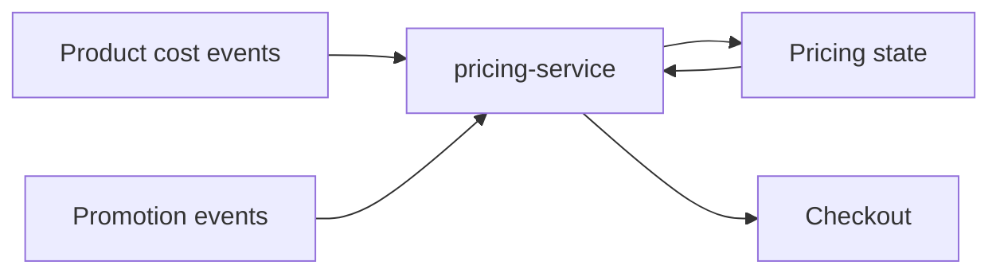
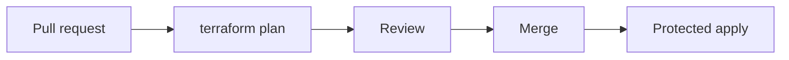

# Before and after examples

These examples show the reasoning behind README Clarity. They intentionally use different structures.

The goal is not to copy the "after" layouts. The goal is to identify what a human needs from each repository and remove everything that does not help.

## 1. Small library

### Before

````markdown
# parse-date-pro

The next-generation date parsing solution for modern applications.

## Features

- Fast
- Powerful
- Flexible
- Developer friendly
- TypeScript support
- Modern architecture

## Installation

npm install parse-date-pro
````

### Problem

The reader gets adjectives before behavior. There is no example, no indication of accepted input, and no useful boundary.

### After

````markdown
# parse-date-pro

Parse a small set of human-readable date strings into JavaScript `Date` objects.

```bash
npm install parse-date-pro
```

```ts
import { parseDate } from "parse-date-pro";

parseDate("tomorrow at 9am");
parseDate("2027-01-15");
```

It supports ISO dates and the relative expressions documented in [SUPPORTED.md](docs/SUPPORTED.md). It does not attempt natural-language parsing beyond that set.
````

### Why it changed

The example demonstrates more than the feature list. The limit matters because the project name could imply broader natural-language parsing.

---

## 2. Internal service

### Before

````markdown
# pricing-service

The Pricing Service is a scalable enterprise-grade microservice leveraging Kafka, PostgreSQL, Redis, Kubernetes, REST, event-driven architecture, and cloud-native design patterns.

## Technologies

- Java
- Spring Boot
- Kafka
- PostgreSQL
- Redis
- Kubernetes
- Helm
- Prometheus
````

### Problem

The opening is mostly technology keywords. A new engineer still does not know where the service sits, what it owns, or how to run it.

### After

````markdown
# pricing-service

Calculates the sell price returned by Checkout.

It consumes product-cost and promotion changes, stores the current pricing state, and exposes the price used by Checkout.



## Run locally

Prerequisites: Java 21 and Docker.

```bash
docker compose up -d postgres kafka
./gradlew bootRun
```

The service starts on `localhost:8080`. See [docs/configuration.md](docs/configuration.md) for non-default configuration.
````

### Why it changed

The system relationship matters more than the technology inventory. A diagram earns its place because several inputs, state, and a consumer must be understood together.

---

## 3. Proof of concept

### Before

````markdown
# pgvector-benchmark

## Features

- PostgreSQL
- pgvector
- HNSW
- IVFFlat
- Docker
- Python
- Benchmarking

## Roadmap

- Add more datasets
- Try more dimensions
- Add charts
````

### Problem

A PoC exists to answer a question. The README does not state the question, current result, or how to reproduce it.

### After

````markdown
# pgvector-benchmark

Tests whether pgvector HNSW can keep p95 nearest-neighbor search below 100 ms for our 5 million-vector workload.

## Current result

On the test machine described below, HNSW met the target at 1 million vectors and exceeded it at 5 million. These results are exploratory, not production capacity estimates.

## Reproduce

```bash
docker compose up -d
uv run benchmark.py --dataset data/sample.parquet
```

Results are written to `results/`.

## Test environment

- PostgreSQL 18
- pgvector 0.x
- 16 vCPU
- 64 GB RAM

## Limits

The benchmark does not model concurrent writes, production network latency, or failover.
````

### Why it changed

The README now explains the question, result, reproduction path, and limits. A roadmap would not help someone evaluate the current experiment.

---

## 4. Monorepo

### Before

````markdown
# platform

This repository contains all platform components.

## Packages

- api
- worker
- ui
- shared
- schemas
- tooling
- infra
- scripts

## Setup

See each package.
````

### Problem

The package list does not explain how the repository is organized or what a contributor should do first.

### After

````markdown
# platform

Monorepo for the customer-facing web application and the services that support it.

## Repository map

| Path | Purpose |
| --- | --- |
| `apps/web` | Customer web application |
| `services/api` | Public application API |
| `services/worker` | Background jobs |
| `packages/schemas` | Shared API and event schemas |
| `infra/` | Deployment configuration |

Package-specific commands live with each package. Shared workflows run from the repository root.

## Start the development stack

```bash
pnpm install
pnpm dev
```

This starts the web app, API, and local dependencies used for normal feature development.

For service-specific work, follow the README in that service directory.
````

### Why it changed

A compact map answers the navigation problem better than an unexplained package list. The README also gives one default workflow instead of sending the reader elsewhere immediately.

---

## 5. Infrastructure repository

### Before

````markdown
# production-infra

Infrastructure as code.

## Features

- Terraform
- AWS
- EKS
- RDS
- VPC
- S3
- IAM
- GitHub Actions
````

### Problem

The technologies are visible, but the operational boundary is not. A reader needs to know what this repository controls and how changes move safely.

### After

````markdown
# production-infra

Terraform configuration for the production AWS account.

It owns the VPC, EKS cluster, RDS databases, shared IAM roles, and supporting infrastructure. Application manifests are managed in `deployment-config`, not here.

## Change workflow



Run a local plan with:

```bash
terraform init
terraform plan
```

Do not apply production changes from a developer workstation. Production applies run through the protected CI environment.

See [docs/recovery.md](docs/recovery.md) before changing stateful resources.
````

### Why it changed

For infrastructure, ownership and change safety are first-order information. The diagram explains the guarded workflow more clearly than another paragraph would.
